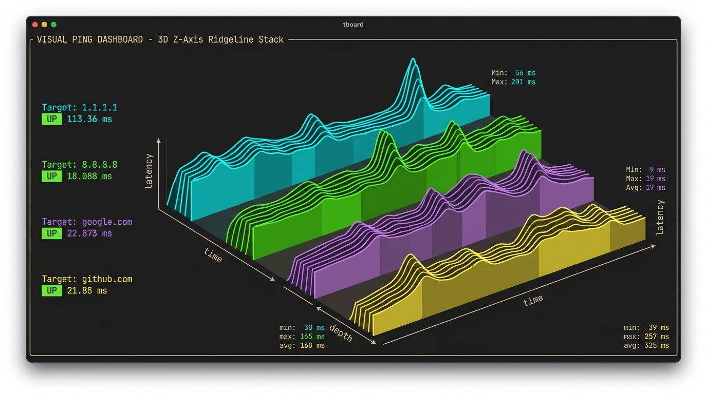
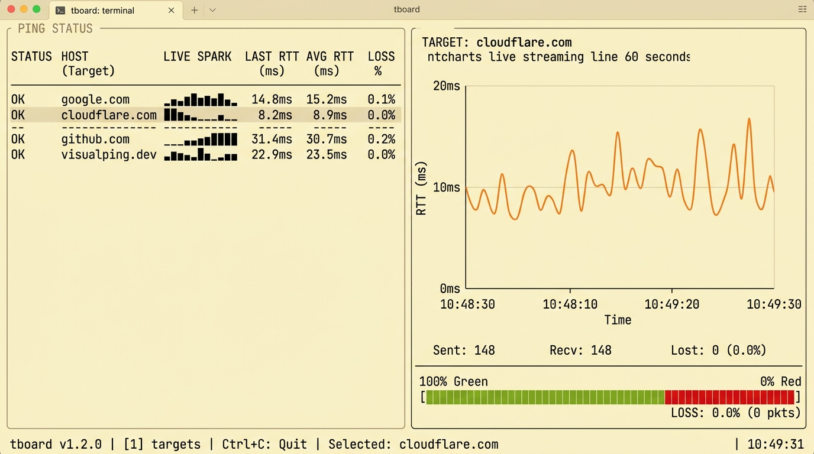

# tboard 📡

An interactive, privilege-free visual **3D Ping Dashboard TUI** built in Go using [Bubble Tea](https://github.com/charmbracelet/bubbletea), [Lip Gloss](https://github.com/charmbracelet/lipgloss), [ntcharts](https://github.com/NimbleMarkets/ntcharts), and [Bubbles](https://github.com/charmbracelet/bubbles).



---

## Highlights

- 🏔 **3D Z-Axis Stacked Waterfall View**: Projects all host latency streams into pseudo-isometric 3D space using a **Painter's Algorithm with Solid Occlusion** fill. Front curves mask back curves to form a solid latency mountain range.
- 📊 **`ntcharts` Live Streaming Integration**: Real-time continuous line chart (`streamlinechart.Model`) and inline sparkline (`sparkline.Model`) data plotting.
- 📐 **Variable Time-Axis Math**: Logarithmic time-axis mapping ($C = 15.0$) expanding recent 10% of time into ~33% visual width, with peak-hold bucket aggregation preserving RTT spikes.
- 🎛 **Interactive 3D Camera Controls**:
  - `w` / `s`: Z-depth tilt adjustment ($\Delta Y$)
  - `←` / `→`: X-slant camera skew ($\Delta X$)
  - `+` / `-`: Height gain scaling
  - `m`: Cycle fill shaders (`Solid Block █`, `Medium Shade ▓`, `Light Shade ▒`, `Wireframe ━`)
- 🎨 **Multi-Theme Support**: Built-in palettes for **Gruvbox Light**, **Dracula Dark**, and **Adaptive Auto**, toggleable at runtime with `t`.
- 💻 **UNIX-y CLI & Config Files**: Pass target arguments (`tboard 1.1.1.1 8.8.8.8:53 google.com:443`), CLI flags (`-c`, `-p`, `-t`, `-v`, `-h`), or auto-discover YAML/JSON configs (`tboard.yaml`).
- ⚡ **Privilege-Free TCP Probing**: TCP connection checks require no `sudo` or raw socket root permissions.

---

## Dashboards & Views

### 1. 3D Ridgeline Stacked Waterfall View
*(Default View Mode - Press `Tab` or `v` to cycle views)*
All host latency profiles projected onto a 3D isometric grid with depth-ordered solid occlusion.

### 2. Split Table & Live Stream View

Combines an ANSI-safe host summary table (with logarithmic sparklines and packet loss progress bars) with an `ntcharts` live latency stream graph for the selected target host.

---

## Keybindings Reference

| Action | Shortcuts | Description |
| :--- | :--- | :--- |
| **Target Navigation** | `↑` / `↓` or `k` / `j` | Scroll host summary table / select target |
| **Cycle View Mode** | `Tab` / `v` | Switch between 3D Stack, Split View, and 2D Stream |
| **3D Z-Depth Tilt** | `w` / `s` | Adjust 3D Z-axis camera tilt ($\Delta Y$) |
| **3D X-Slant Skew** | `←` / `→` | Adjust 3D horizontal slant skew ($\Delta X$) |
| **3D Height Scale** | `+` / `-` | Scale latency peak height multiplier |
| **3D Mesh Fill Shader**| `m` | Cycle mesh fill (`█`, `▓`, `▒`, `━`) |
| **Theme Toggle** | `t` | Cycle theme (`Gruvbox Light`, `Dracula`, `Auto`) |
| **Add Target** | `a` | Add new host (e.g. `example.com:443`) |
| **Delete Target** | `x` | Remove selected target |
| **Pause Probing** | `Space` | Pause / resume background pings |
| **Reset Stats** | `r` | Reset stats and clear history buffers |
| **Toggle Help** | `?` | Show / hide detailed keybinding help |
| **Quit** | `q` or `Ctrl+C` | Exit dashboard |

---

## Usage & CLI Flags

```bash
# Direct target arguments
tboard 1.1.1.1 8.8.8.8:53 google.com:443 github.com

# Custom config file & theme
tboard -c ~/.config/tboard/config.yaml -t gruvbox-light
```

### CLI Flags

- `-c, --config <file>`: Path to config file (`.json` or `.yaml`)
- `-p, --port <port>`: Default port when omitted (default: `80`)
- `-t, --theme <name>`: Initial color theme (`gruvbox-light`, `dracula`, `auto`)
- `-v, --version`: Print version information
- `-h, --help`: Show help overview

---

## Build & Test

```bash
make build    # Compiles executable to bin/tboard
make test     # Executes full unit test suite
make run      # Runs tboard directly via mise
```

---

## License

[MIT](LICENSE)
